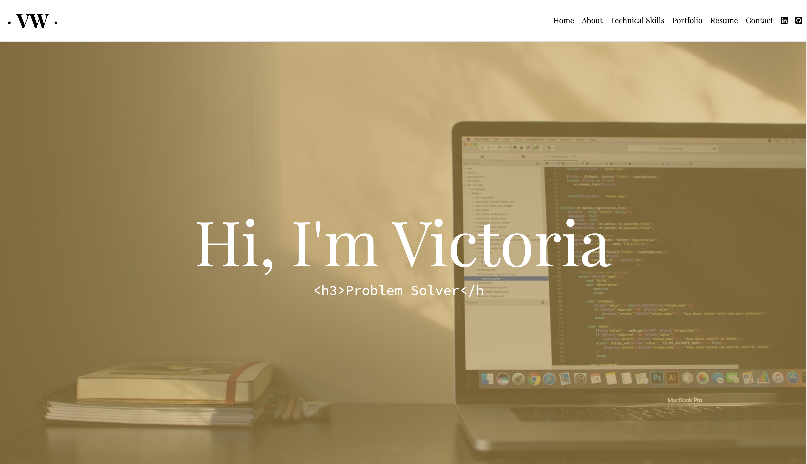
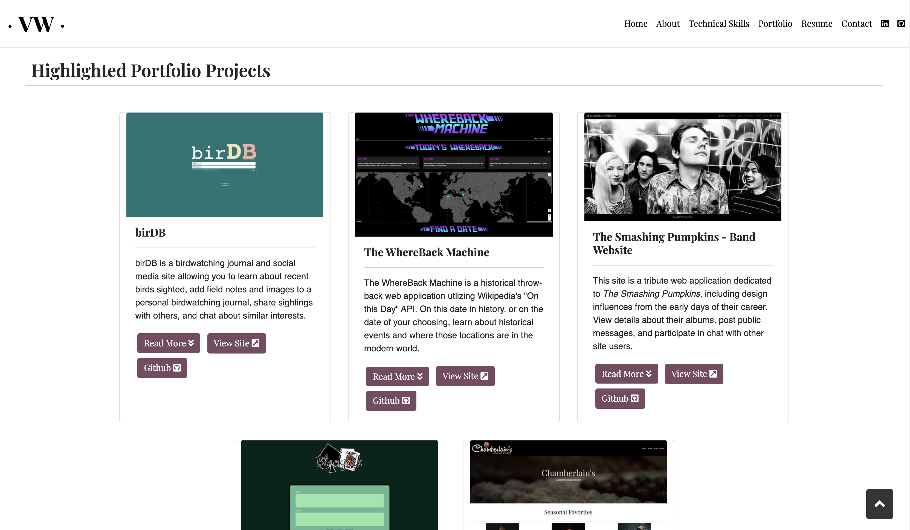
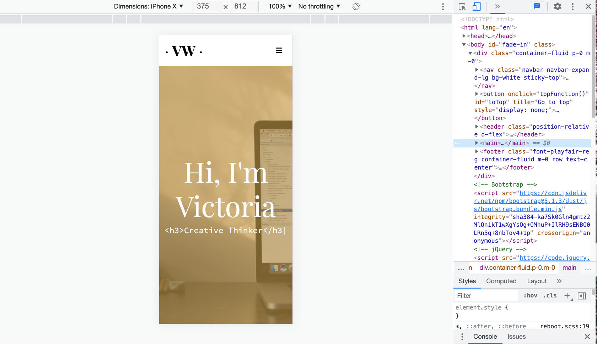
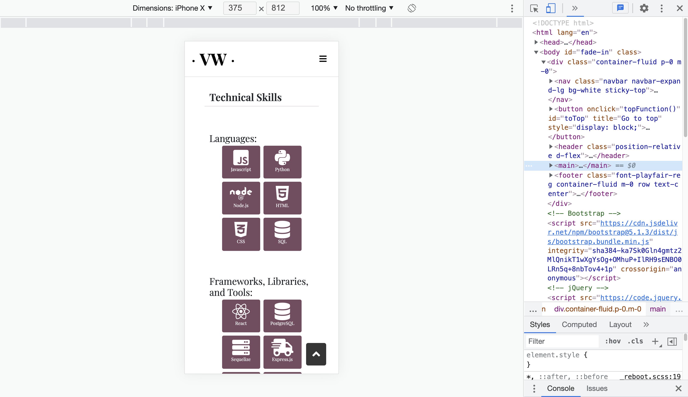

# Personal Portfolio Site

Deployed site: [thevictoriawalker.dev](https://thevictoriawalker.dev/)

A light-weight and responsive personal portfolio site develped to showcase selected applications I have built recently as well as to share a bit about me, my software development journey, my skillset, and my resume. Featured projects include team and individual projects.

---

## Technical Stack
Languages:  
  
  

Technologies/Libraries:  
  
  
  

Hosting:  

---

## Screenshots

---
## Developer

Victoria Walker:
- https://github.com/v-walker
- Layout/Design
- Development
- Deployment
